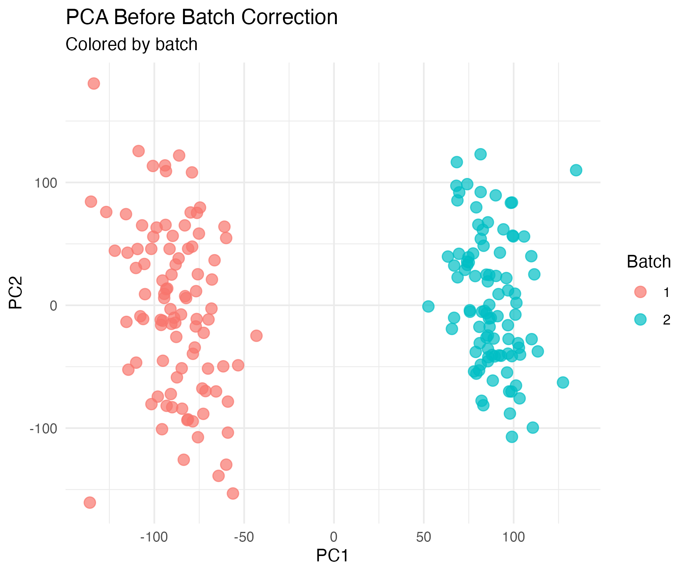
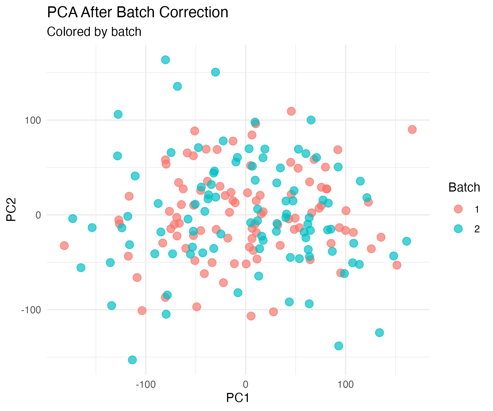
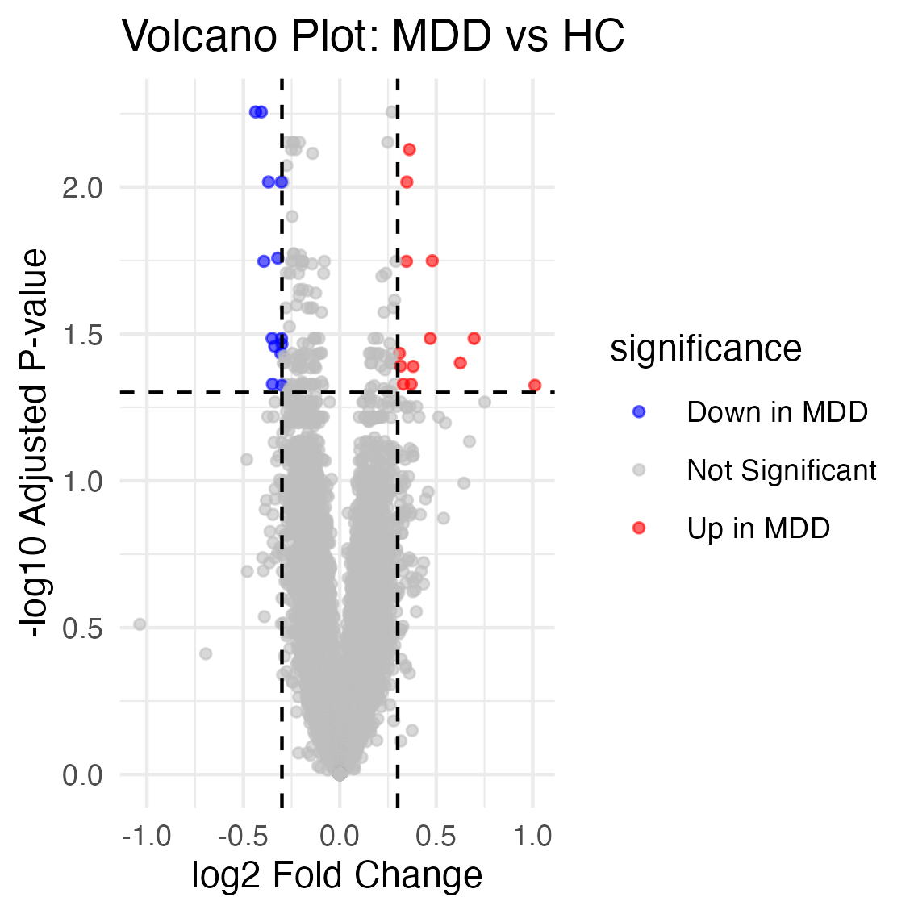
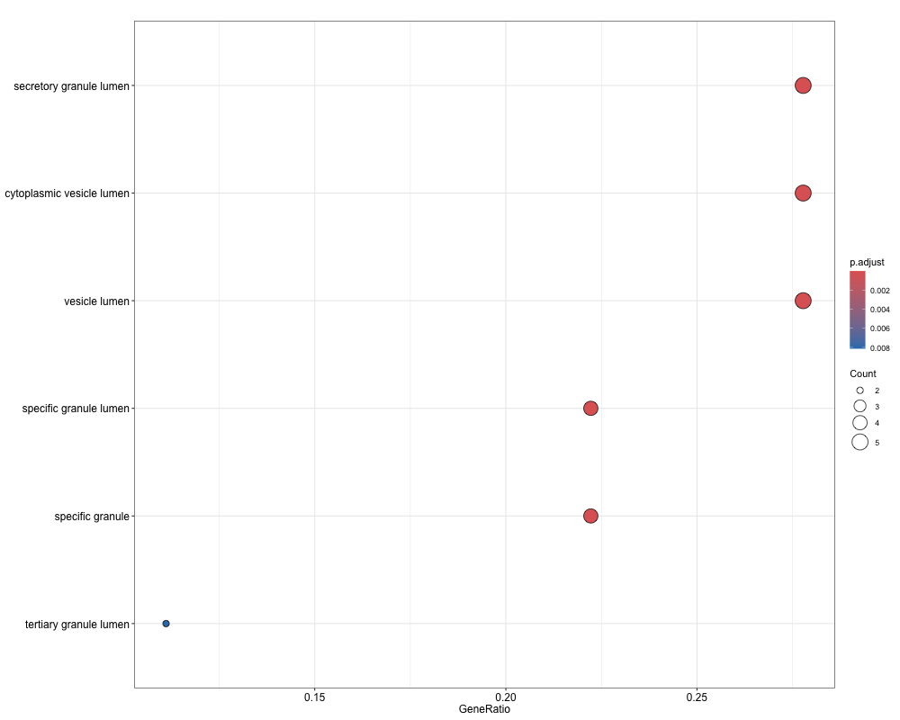
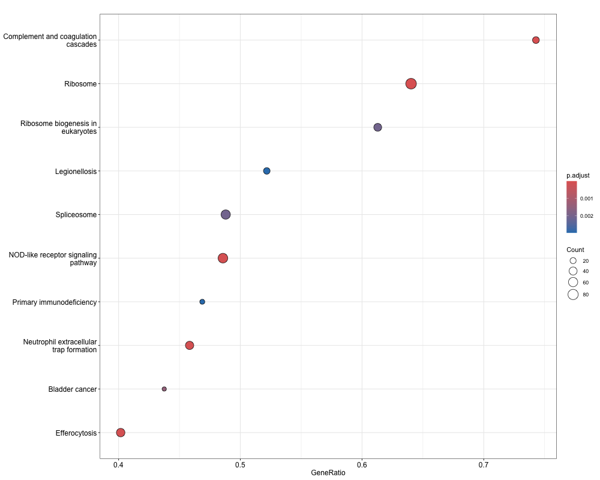
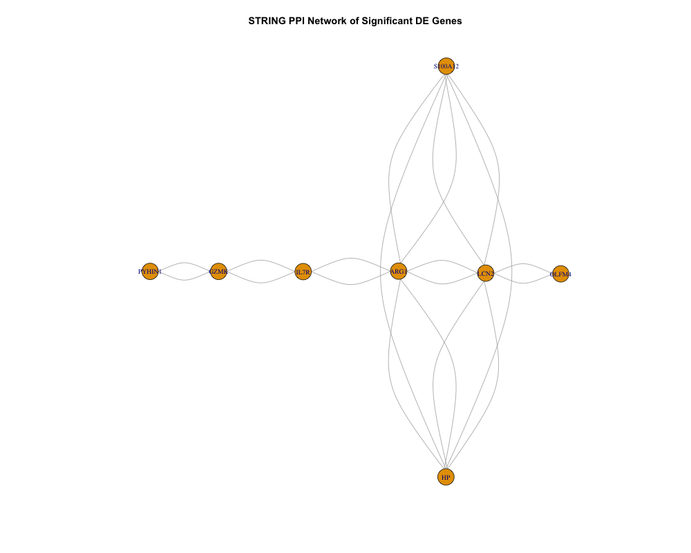
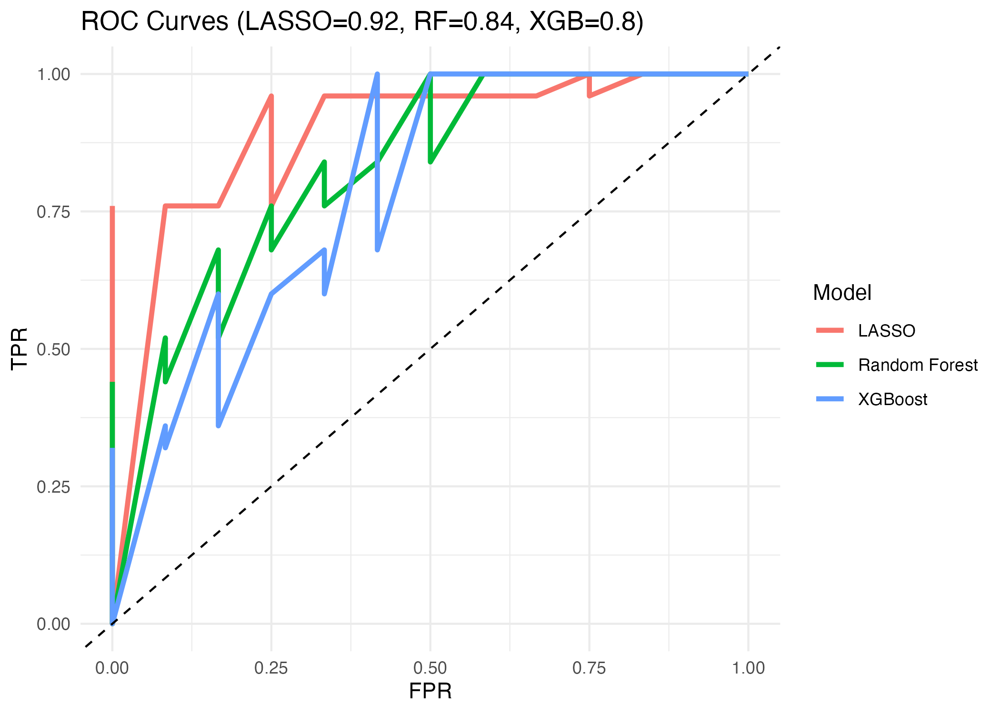
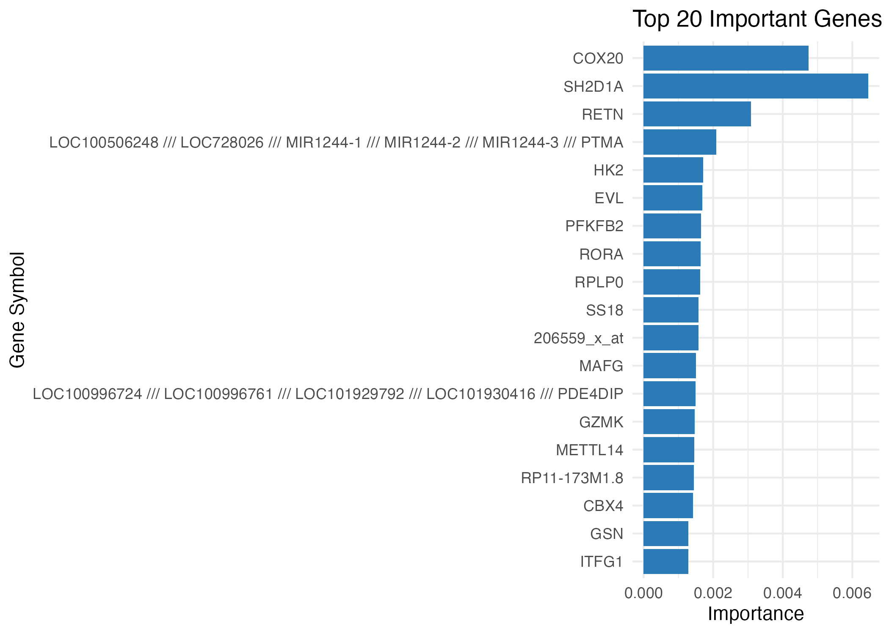

# Gene Expression Analysis and Machine Learning Modeling for Major Depressive Disorder (MDD)

An end-to-end bioinformatics project investigating gene expression changes associated with Major Depressive Disorder (MDD) using public GEO microarray data (GSE98793, n = 192).

---
## Overview

This project integrates statistical analysis, functional enrichment, protein-protein interaction (PPI) network analysis, and machine learning to characterize transcriptomic changes in MDD.

The workflow spans from raw expression data to biologically interpretable findings, with a focus on identifying immune-related gene signatures and evaluating their predictive power.

---
## Dataset

* **GEO Accession:** GSE98793
* **Samples:** 192 (64 healthy controls, 128 MDD cases)
* **Platform:** Affymetrix microarray
* **Source:** Peripheral blood gene expression data

---
## Pipeline

### 1. Data Preprocessing (01_data_preprocessing.R)

* Loaded GEO series matrix using GEOquery
* Applied log2 transformation
* Filtered low-expression probes (mean > 5)
* Extracted phenotype and annotation data

### 2. QC and Batch Correction (02_qc_pca.R)

* PCA before/after batch correction
* Batch effect removed using ComBat (sva)
* Reduced PC1 variance from 29.7% → 20.0%

### 3. Differential Expression (03_differential_expression.R)

* limma with empirical Bayes
* Model: `~ pheno_factor + batch`
* Threshold: adj.P.Val < 0.05, |logFC| > 0.3
* Identified **26 significant DEGs**

### 4. Functional Enrichment (04_GO_KEGG_enrichment.R)

* Gene Ontology (GO) enrichment (over-representation analysis)
* KEGG pathway enrichment (ORA)
* GSEA-based KEGG pathway analysis (using ranked gene list)
* Gene ID conversion (SYMBOL -> ENTREZID)

### 5. PPI Network (05_string_ppi_network.R)

* STRING v12 (score ≥ 400)
* Network constructed via igraph
* Hub genes: ARG1, LCN2, HP, S100A12

### 6. Machine Learning (06_ml_model_comparison.R)

* Selected ~150 genes with adjusted p-value < 0.05 (without logFC filtering) as features
* Models: LASSO, Random Forest, XGBoost
* This relaxed filtering allows the model to capture more potentially predictive signals beyond the stricter DEG threshold.

---
## Key Results

### Differential Expression

* 26 DEGs identified
* Top DE genes (ranked by adjusted p-value / logFC): RORA, GZMK, RETN, MAFG


### Enrichment Analysis

  * GO enrichment highlighted vesicle- and granule-related terms:
    * vesicle lumen
    * secretory granule lumen
    * specific granule lumen

  * While over-representation analysis (ORA) using KEGG did not identify significant pathways due to the limited number of DE genes, gene set enrichment analysis (GSEA) revealed significant pathway-level enrichment, including immune-related and inflammatory pathways.

This highlights the importance of using ranking-based methods to capture subtle but coordinated biological signals.

  * GSEA-KEGG identified pathway-level enrichment, including:
    * Complement and coagulation cascades
    * Neutrophil extracellular trap formation
    * NOD-like receptor signaling pathway
    * Ribosome / spliceosome-related processes

  * These results suggest immune-related pathway dysregulation and inflammatory mechanisms in MDD.

## Key Visualizations

### PCA (Before Batch Correction)


### PCA (After Batch Correction)


### Volcano Plot


### GO Enrichment


### GSEA-based KEGG Pathway Enrichment


### PPI Network


### ROC Curve


### Feature Importance


### Enrichment Analysis

* Significant GO terms enriched in:

  * vesicle lumen
  * secretory granule lumen
* Indicates **neutrophil-mediated immune activity**

### PPI Hub Genes

* Hub genes:

  * ARG1 (degree = 8)
  * LCN2 (degree = 8)
* Suggests coordinated innate immune activation

---
## Machine Learning Performance

* **LASSO AUC: 0.91 (best)**
* Random Forest AUC: 0.84
* XGBoost AUC: 0.80

LASSO outperformed other models, likely due to its ability to handle high-dimensional data and perform embedded feature selection.

---
## Biological Interpretation

Top features identified by Random Forest(based on model importance):

* CD48
* SH2D1A
* GZMK
* RETN

These genes are involved in **immune cell activation, inflammation, and T-cell signaling**.
Notably, some genes (e.g., GZMK, RETN) were consistently identified by both statistical and machine learning approaches, suggesting robust biological relevance.

Importantly, these findings are consistent with:

* GO enrichment results (immune-related pathways)
* PPI network (innate immune hub genes)

> Together, both statistical and machine learning analyses independently highlight **immune dysregulation as a key mechanism in MDD**.

---
## Project Structure

```
MDD_microarray_analysis/
├── scripts/
│   ├── 01_data_preprocessing.R
│   ├── 02_qc_pca.R
│   ├── 03_differential_expression.R
│   ├── 04_GO_KEGG_enrichment.R
│   ├── 05_string_ppi_network.R
│   └── 06_ml_model_comparison.R
│
├── results/
│   ├── MDD_DE_results_full.csv
│   ├── MDD_DE_genes_sig.csv
│   ├── GO_enrichment_results.csv
│   ├── KEGG_enrichment_results.csv
│   ├── STRING_hub_genes.csv
│   ├── ML_model_comparison_summary.csv
│   ├── LASSO_selected_features.csv
│   ├── RandomForest_feature_importance.csv
│   ├── XGBoost_feature_importance.csv
│   └── GSEA_KEGG_results.csv
│
├── plots/
│   ├── PCA_before_batch.png
│   ├── PCA_before_group.png
│   ├── PCA_after_batch.png
│   ├── PCA_after_group.png
│   ├── MDD_volcano_plot.png
│   ├── GO_dotplot.png
│   ├── GSEA_KEGG_dotplot.png
│   ├── STRING_PPI_network.png
│   ├── ML_ROC_curve.png
│   └── RandomForest_top20_feature_importance.png
│
└── README.md
```

Each step of the pipeline is modularized into separate scripts for reproducibility and clarity.

---
## Reproducibility

```r
setwd("your_project_directory")

source("scripts/01_data_preprocessing.R")
source("scripts/02_qc_pca.R")
source("scripts/03_differential_expression.R")
source("scripts/04_GO_KEGG_enrichment.R")
source("scripts/05_string_ppi_network.R")
source("scripts/06_ml_model_comparison.R")
```

---
## Tools & Packages

* GEOquery, limma, sva
* clusterProfiler, org.Hs.eg.db
* STRINGdb, igraph
* ranger, glmnet, xgboost
* ggplot2

---
## Environment

- R version: 4.4+
- Key packages:
  - limma
  - clusterProfiler
  - STRINGdb
  - ranger
  - glmnet
  - xgboost
 
---
## Data Access

Data is publicly available from GEO:

- Accession: GSE98793  
- Platform: Affymetrix microarray  

Downloaded using GEOquery in R.

---
## Limitations

- The number of significant DE genes was relatively small, which limited the power of ORA-based KEGG analysis.
- The dataset is based on peripheral blood, which may not fully capture brain-specific mechanisms in MDD.

---

## Key Takeaway

This project demonstrates that immune-related gene signatures consistently emerge across differential expression, network analysis, and machine learning models, highlighting immune dysregulation as a central mechanism in MDD.

---
## Author

**Xinyue (Kitty) Hu**
M.S. Computer Science, University of Tulsa
GitHub: github.com/xih0320
