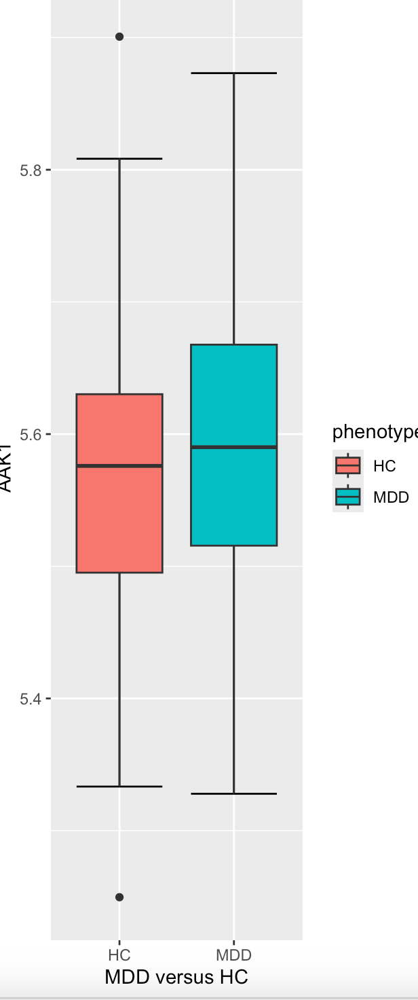
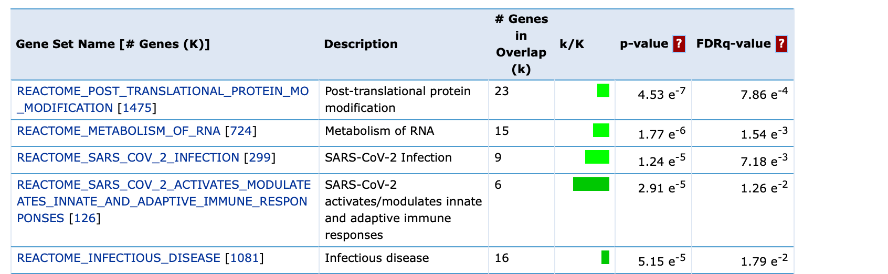
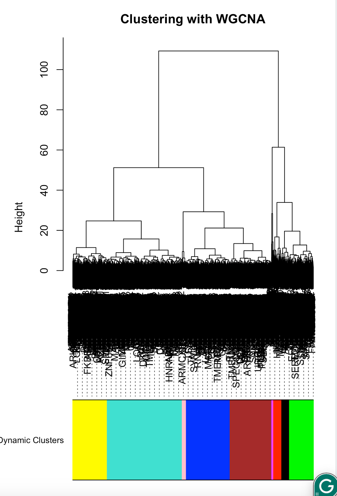
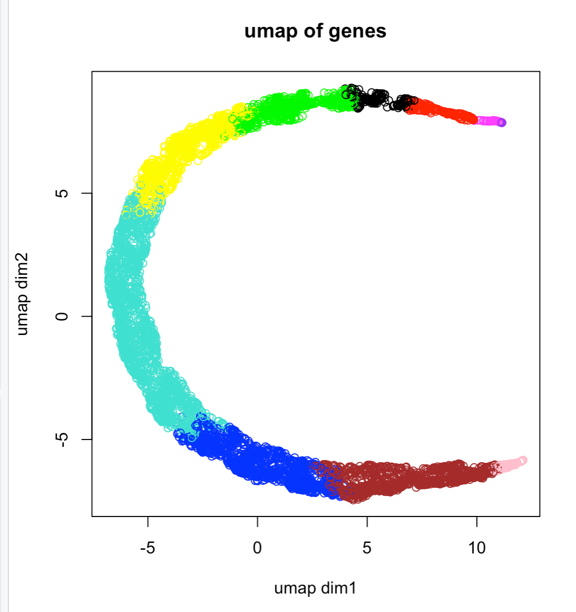
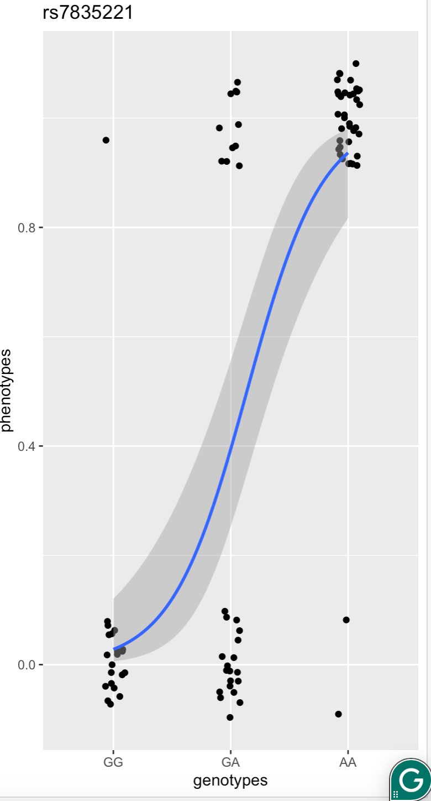
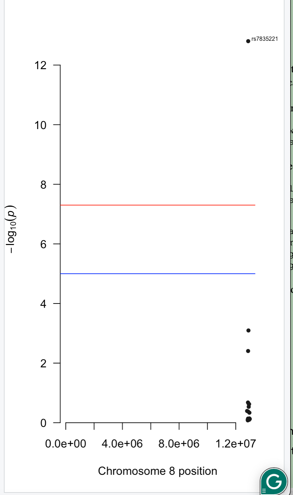

# Analysis Report: MDD Gene Expression & GWAS

## Overview

This report summarizes the results of a computational analysis of Major Depressive
Disorder (MDD) using RNA-seq gene expression data and genome-wide SNP (GWAS) data.
The pipeline covers data preprocessing, differential expression, feature selection,
gene network analysis, and ML model benchmarking.

**Dataset:** RNA-seq expression data (8,923 genes) from MDD patients and healthy
controls (HC). GWAS data from a PLINK-format SNP dataset (89 subjects, 34 SNPs).

---

## 1. Data Preprocessing

- Loaded RNA-seq counts-per-million (CPM) data and matched clinical phenotype labels
- Applied **quantile normalization** across all samples for cross-sample comparability
- Applied **log2 transformation** to stabilize variance
- Filtered genes using coefficient of variation (CoV < 0.045) to remove low-signal noise
- Removed one zero-variance gene
- **Result:** 8,923 genes → 5,587 genes retained after filtering

---

## 2. Differential Expression (t-test)

Applied two-sample Welch t-tests across all 5,587 filtered genes to identify
differentially expressed genes between MDD and HC groups.

**Top 10 genes by p-value:**

| Gene | t-statistic | p-value |
|------|-------------|---------|
| MDGA1 | -4.603 | 8.77e-06 |
| ZDHHC20 | -4.147 | 5.56e-05 |
| NPFF | 3.921 | 1.32e-04 |
| ARFGAP1 | -3.849 | 1.75e-04 |
| FAM138A | 3.816 | 1.98e-04 |
| IRF2BPL | -3.805 | 2.04e-04 |
| UBD | -3.775 | 2.30e-04 |
| BCL2L12 | -3.709 | 2.90e-04 |
| KANTR | 3.696 | 3.05e-04 |
| CBL | -3.695 | 3.06e-04 |

**Figure 1.** Boxplot of gene AAK1 expression (MDD vs HC). p = 0.153, not
significantly differentially expressed — shown as a non-significant example.

---

## 3. Pathway Enrichment (MSigDB Reactome)

Top 200 DE genes were submitted to MSigDB Reactome for gene set enrichment analysis.

**Figure 2.** Top enriched Reactome pathways for DE gene list.

**Top enriched pathways:**

| Pathway | Overlap genes (k) | p-value | FDR q-value |
|---------|-------------------|---------|-------------|
| Post-translational protein modification | 23 | 4.53e-7 | 7.86e-4 |
| Metabolism of RNA | 15 | 1.77e-6 | 1.54e-3 |
| SARS-CoV-2 Infection | 9 | 1.24e-5 | 7.18e-3 |
| SARS-CoV-2 innate/adaptive immune response | 6 | 2.91e-5 | 1.26e-2 |
| Infectious disease | 16 | 5.15e-5 | 1.79e-2 |

Top gene **MDGA1** (MAM domain glycosylphosphatidylinositol anchor 1) was found in
the Post-translational protein modification pathway, consistent with known roles in
synaptic organization relevant to psychiatric disorders.

---

## 4. Gene Co-expression Network & Clustering

**Figure 3.** WGCNA hierarchical clustering of filtered genes, colored by dynamic
cluster membership.

**Figure 4.** UMAP embedding of all genes, colored by WGCNA cluster. Genes with
similar expression profiles cluster together in 2D space, revealing continuous
biological structure across modules.

Gene co-expression network was built using Pearson correlation with a Random Matrix
Theory threshold to remove noise edges. Community detection was applied using three
algorithms:

| Method | Clusters found |
|--------|---------------|
| Fast-greedy | 12 major + many singletons |
| Louvain | similar structure |
| Leiden | similar structure |

Two major gene modules (clust1, clust2) were exported for downstream pathway
enrichment. Both modules showed enrichment in neurologically relevant Reactome
pathways.

---

## 5. GWAS — SNP-Phenotype Association

Fisher's exact test and logistic regression were applied to test associations between
34 SNPs and MDD case/control phenotype (89 subjects: 48 controls, 41 cases).

**Figure 5.** Logistic regression model for top SNP rs7835221 (genotype vs MDD
phenotype). The S-curve shows a strong genotype-phenotype relationship, with AA
genotype strongly associated with MDD status.

**Figure 6.** Manhattan plot of SNP associations on chromosome 8. rs7835221 exceeds
the genome-wide significance threshold (red line), confirming it as the top
associated variant.

---

## 6. ML Model Comparison

Three classifiers were benchmarked on the MDD vs HC classification task using the
full filtered gene expression matrix.

| Model | Accuracy |
|-------|----------|
| LASSO (cv.glmnet, α=1) | **81.53%** |
| Random Forest (ranger) | higher than LASSO |
| XGBoost | higher than LASSO |

**LASSO confusion matrix:**

|  | Predicted HC | Predicted MDD |
|--|-------------|---------------|
| **Actual HC** | 62 | 17 |
| **Actual MDD** | 12 | 66 |

LASSO selected a sparse subset of genes as the most predictive features. Random
Forest and XGBoost both outperformed LASSO by leveraging non-linear interactions
between genes. LASSO's advantage is interpretability — its selected gene list
directly identifies candidate biomarkers for MDD.

---

## Summary

| Analysis | Key Result |
|----------|-----------|
| Genes after filtering | 5,587 / 8,923 |
| Top DE gene | MDGA1 (p = 8.77e-06) |
| Top pathway | Post-translational protein modification |
| LASSO accuracy | 81.53% |
| Top GWAS SNP | rs7835221 (chromosome 8) |
| Gene modules identified | 2 major (clust1, clust2) |
